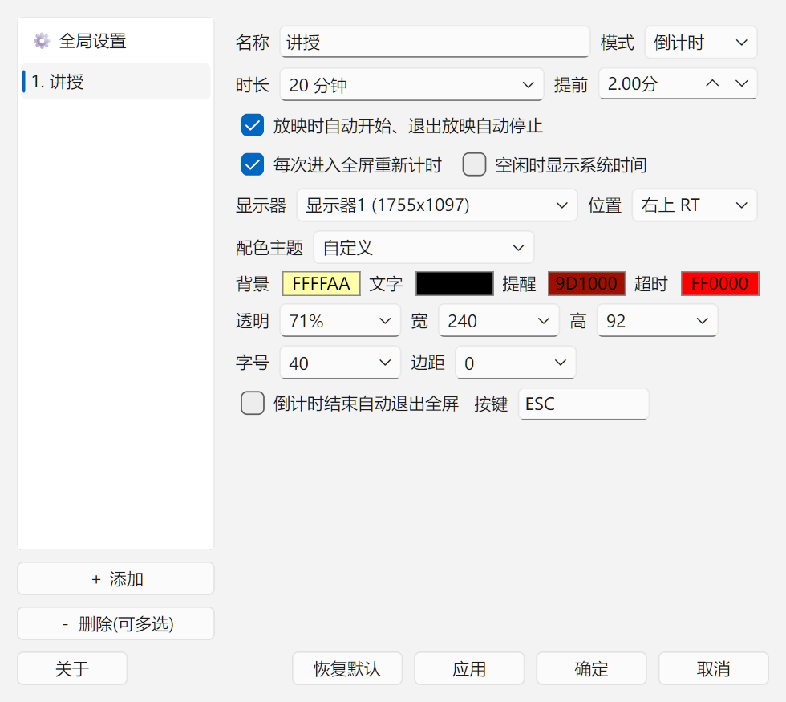
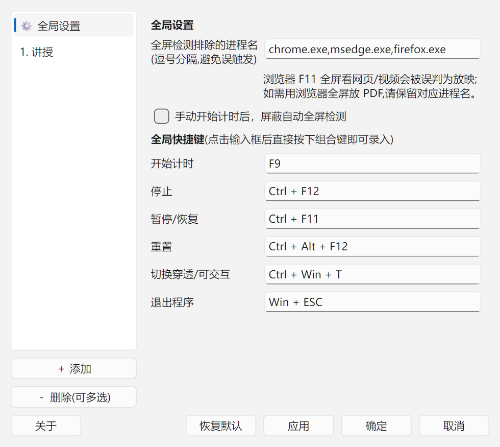

<div align="center">


# SlideClocker — PPT / PDF 全屏放映计时器


**放映时自动开始、退出放映自动停止的悬浮计时窗。为授课、演讲、答辩而生。**


</div>

---

## 软件介绍

SlideClocker 是一款运行在 Windows 上的**放映计时器**。当你用 PowerPoint、WPS 或 PDF 阅读器进入全屏放映时,它会在屏幕角落浮出一个置顶计时窗,自动开始倒计时;退出放映时自动停止并保留本场用时。

它解决的是讲台上的真实痛点:**演讲者需要随时知道"还剩多少时间",又不能打断放映、不能发出声音、不能被观众看见操作界面。** 因此 SlideClocker 全程只做**纯视觉提醒**(变色 + 闪烁),没有任何声音;悬浮窗在放映时自动鼠标穿透,绝不挡住你的翻页操作。

- **多窗口**:可同时挂多个独立计时窗(例如"讲授"与"答疑"),各自配置时长、配色、所在显示器。
- **多显示器**:每个计时窗可指定显示器,或镜像到全部显示器;支持一键换屏。
- **免安装**:单文件 exe / 绿色压缩包,解压即用;设置随文件夹携带。

## 功能特性

| 类别 | 能力 |
| --- | --- |
| 自动启停 | 检测全屏放映自动开始计时,退出放映自动停止;每场可"重新计时"或"续计" |
| 计时模式 | 倒计时 / 正计时 |
| 提醒方式 | 提前提醒、超时提醒,均为**变色 + 闪烁**,纯视觉、无声音 |
| 空闲挂钟 | 未放映时主区可显示当前系统时间(可选) |
| 多窗口 / 多屏 | 任意多个计时窗;指定显示器或"全部显示器"镜像;一键移到下一显示器 |
| 外观 | 6 套预置配色主题一键切换;背景/文字/提醒/超时四色、字体、字号、宽高、透明度、位置、边距全自定义 |
| 悬浮窗交互 | 未全屏可右击菜单、拖动定位(位置自动保存);全屏自动鼠标穿透,可手动切换 |
| 全局快捷键 | 开始/停止/暂停/重置/切换穿透/退出,全部可自定义,**按下即录入** |
| 系统托盘 | 实时状态、开始/暂停/停止/重置、时长 ±1 分钟 |
| 结束动作 | 倒计时结束可自动退出全屏(发送可配置按键序列,默认 `ESC`) |
| 手动模式 | 可选"手动开始后屏蔽自动全屏检测",避免放映进出打断手动计时 |
| 误判防护 | 全屏检测可排除指定进程(默认排除浏览器,避免 F11 看网页误判) |
| 单实例 | 防多开,重复启动会提示 |
| 便携 | 设置存于 exe 同目录 `settings.json`,换机拷贝文件夹即可 |

## 界面截图

**四种提醒状态**(空闲挂钟 / 计时中 / 提前提醒 / 已超时):


**设置 — 计时窗口页**:



**设置 — 全局页**(排除进程 + 快捷键录入):



**系统托盘菜单**:


**关于**:


## 下载与安装

到 [Releases](../../releases) 页下载,三种形态任选其一:

| 形态 | 文件 | 说明 |
| --- | --- | --- |
| 安装版 | `SlideClocker_v1.0.0_安装版.exe` | 双击安装,带开始菜单/桌面快捷方式与卸载项;按当前用户安装,无需管理员权限 |
| 绿色便携版 | `SlideClocker_v1.0.0_绿色版.zip` | 解压即用,免安装免卸载,删除文件夹即卸载 |
| 单文件版 | `SlideClocker.exe` | 单个可执行文件,拷到任意位置直接运行 |

> 首次运行若被 Windows SmartScreen / 杀毒软件拦截,是因为程序未做数字签名,选择"仍要运行"即可。

**系统要求**:Windows 10 / 11(64 位)。

## 快速上手

1. 启动程序,托盘出现图标,计时窗常驻屏幕角落(未放映时显示"尚未放映")。
2. 用 PPT / WPS / PDF 进入全屏放映 → 计时窗自动开始倒计时。
3. 接近设定时长时数字变为**提醒色**并闪烁;超时后变为**超时色**并显示"已超时"。
4. 退出放映 → 自动停止,小字显示本场用时。
5. 右击托盘或计时窗可开始/暂停/停止/重置、调整时长、打开设置。

## 默认快捷键

| 动作 | 默认按键 |
| --- | --- |
| 开始计时 | `F9` |
| 停止 | `Ctrl + F12` |
| 暂停 / 恢复 | `Ctrl + F11` |
| 重置 | `Ctrl + Alt + F12` |
| 切换鼠标穿透 / 可交互 | `Ctrl + Win + T` |
| 退出程序 | `Win + Esc` |

全部快捷键可在 **设置 → 全局设置** 中点击输入框后直接按下组合键重新录入。

## 开发与构建

```bash
# 依赖
pip install -r requirements.txt

# 运行
python main.py

# 打包单文件 exe(自动剔除用不到的 Qt 模块以减小体积)
build.bat

# 打包安装版(需先安装 Inno Setup 6)
"C:\Program Files (x86)\Inno Setup 6\ISCC.exe" SlideClocker.iss
```

技术栈:Python 3.10+ / PySide6(Qt6)/ pywin32(全屏检测与全局快捷键)/ psutil。

重新生成发布截图:

```bash
python tools/make_screenshots.py
```

## 常见问题

**Q: 浏览器按 F11 全屏看网页,计时窗误启动了?**
A: 设置 → 全局设置 → "全屏检测排除的进程名" 中加入对应进程(如 `chrome.exe`)。默认已排除主流浏览器;若需用浏览器全屏放 PDF,请保留/移除对应进程名。

**Q: 设置保存在哪里?换电脑怎么办?**
A: 保存在程序同目录的 `settings.json`。绿色版/单文件版把整个文件夹拷走即可;安装版位于安装目录。

**Q: 能不能有声音提醒?**
A: 本软件定位为**纯视觉**提醒(讲台场景不宜出声),暂不提供声音。

**Q: 为什么不能重复启动?**
A: 单实例设计,避免多个托盘/计时窗互相干扰。如需重开,先从托盘退出当前实例。

## 版权与联系

- 作者:**郑在探索**
- 邮箱:zhengnan.me@gmail.com
- 网站:[www.znup.top](https://www.znup.top)
- 版权:© 2026 郑在探索 制作发布

本项目当前**保留所有权利**。如你希望以开源许可证(如 MIT)发布,请在仓库根目录添加 `LICENSE` 文件并在此处声明。
